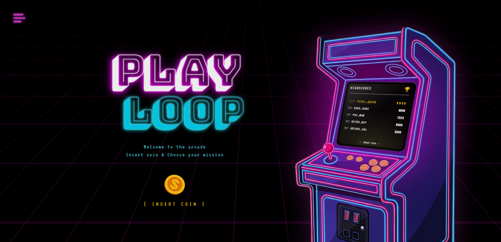

<big>Frontend-student ved Kodehode, med lidenskap for å skape vakre og funksjonelle nettsider.
Jeg har lært HTML, CSS, Figma, JavaScript og React på kurset, og hvordan man bygger komponentbaserte og responsive nettsider.</big>

<big>Jeg elsker å eksperimentere med webdesign, lage intuitive grensesnitt og teste små designideer med farger, typografi og layout.</big>

##  Utvalgte prosjekter
Her er noen prosjekter jeg har laget med HTML, CSS, JavaScript og React.  

<!-- Playloop -->

  <h3>Playloop</h3>
  
  
En interaktiv spillportal inspirert av retro spillestetikk og arkadekultur. Bygget med React, Tailwind og Framer Motion

  

    <a href="https://aashildf.github.io/PlayLoop/">Kode</a> | 
    Live: Kan kjøres lokalt
  

<!-- Vær-app -->

  <h3>Bergen vær-app</h3>
  
  
React-app som viser værdata fra API. Illustrasjoner er knyttet til ulike værkoder, hvor figurer skifter antrekk etter været, og du får en lokaltilpasset liten værmelding med hva du kan gjøre i Bergen i dag..

  

    <a href="https://github.com/bruker/var-app">Kode</a> | 
    <a href="https://var-app.vercel.app">Live demo</a>
  

<!-- Fargeleggins app -->

  <h3> 
The Little Fox`s Colorbook</h3>
  
  
En interaktiv fargeleggings-app bygget med React. Prosjektet lar brukere gi liv til en håndtegnet rev ved hjelp av en fargepalett inspirert av klassisk animasjonsfilm.

  

    <a href="https://aashildf.github.io/Fargevelger/">Kode</a> | Live: Kan kjøres lokalt
  

<!-- Gutenberg_booksearch-->

  <h3>Gutenberg booksearch</h3>
  
  
En moderne web-applikasjon for å utforske, søke og lagre klassisk litteratur fra Project Gutenberg. Dynamisk bibliotek som  henter tusenvis av bøker i sanntid via Gutendex API...

  

    <a href="https://aashildf.github.io/Gutenberg_booksearch/">Kode</a> | Live: Kan kjøres lokalt
  

<!-- api studio-->

  <h3>API-studio</h3>
  
  

  

    <a href="https://aashildf.github.io/my-portfolio-api-site/">Kode</a> | Live: Kan kjøres lokalt
  

---

## Teknologier og verktøy

## Webdesign & UI/UX

<big>Fokus på brukervennlighet og estetikk</big> 
<big>Responsivt layout og moderne komponentdesign</big> 
<big>Eksperimentering med farger, typografi og microinteractions</big>

## Mest brukte språk

## Kontakt

📧 faas0825@gmail.com 
💼 [LinkedIn](https://linkedin.com/in/åshild-færøy-855595108) 
🌐 Portfolio: kommer snart
